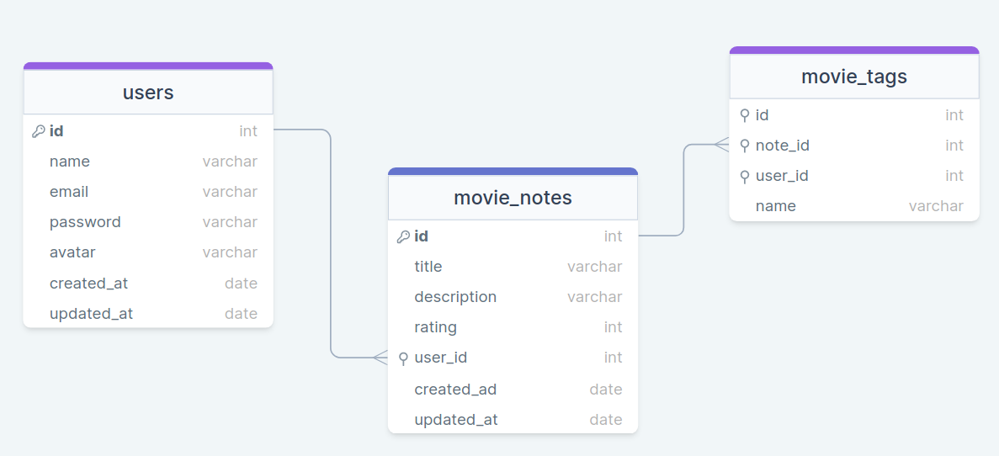

<h1 align="center"> RocketMovies Back-End </h1>


<p align="center"> API desenvolvida em Node.js para um sistema de gestão de filmes, notas e tags, com autenticação de usuários e CRUD completo. Projeto desenvolvido durante o programa Explorer da Rocketseat.
</p>

<br>

<p align="center">
  
</p>

<br>

## 🚀 Tecnologias

Esse projeto foi desenvolvido com as seguintes tecnologias:

- Node.js
- Express
- SQLite
- Knex.js
- JWT (Autenticação)
- Bcrypt.js (Hash de senhas)
- dotenv
- CORS
<br><br>


## 💻 Projeto


- <p align="center"> Neste projeto, pude explorar os fundamentos do Node.js para desenvolver uma aplicação de cadastro de filmes. Nela, o usuário tem autonomia para incluir informações básicas do filme, como título, descrição e nota, além da liberdade de adicionar tags relevantes, para melhor categorizá-lo.  <br/><br/></p>

Adicionalmente, busquei incluir no desafio alguns detalhes relevantes aprendidos durante as aulas, dos quais destaco: <br>
- <p> Uso de Hash para criptografia de senhas;
- <p> Validação de E-mail;
- <p> Aplicação do Cascade, para garantir que uma tag será excluída caso o usuário opte por excluir a nota.<br><br>

## 🚀 Funcionalidades

- Cadastro e login de usuários com autenticação JWT
- Atualização de perfil com senha
- Criação, listagem, atualização e exclusão de filmes
- Avaliação de filmes com notas
- Tags para organização e filtro
- Listagem de filmes por título e tags
- Middleware de autenticação protegendo rotas privadas


## 📁 Estrutura de Pastas

```bash
src/
├── controllers/     # Lógica das rotas (Users, Sessions, Movies, Tags)
├── routes/          # Definição das rotas
├── database/        # Migrations e configuração SQLite
├── utils/           # Funções auxiliares (ex: validar e-mails)
├── middlewares/     # Autenticação JWT
├── config/          # Arquivo knexfile.js
```


## 📦 Instalação e Uso

```bash
# Clone o repositório
git clone https://github.com/BernardoSa01/rocketmovies-backend.git

# Acesse a pasta
cd rocketmovies-backend

# Instale as dependências
npm install

# Rode as migrations
npx knex migrate:latest

# Inicie o servidor
npm run dev
```


## 📌 Variáveis de Ambiente
Crie um arquivo .env com as seguintes variáveis:

env
Copiar
Editar
JWT_SECRET=sua_chave_secreta
PORT=3333


## 🧪 Exemplos de uso
A API pode ser testada via ferramentas como Insomnia ou Postman.

**Exemplo de criação de usuário:**

```json
POST /users
{
  "name": "Bernardo",
  "email": "bernardo@email.com",
  "password": "123456"
}
```

**Exemplo de criação de filme:**

```json
POST /movies
Headers: Authorization: Bearer <token>
{
  "title": "Interestelar",
  "description": "Filme sobre viagens no tempo",
  "rating": 5,
  "tags": ["ficção", "espaço"]
}
```


📬 Contato
Conecte-se comigo:

- [LinkedIn](https://www.linkedin.com/in/bernardosa01)
- [E-mail](mailto: bernardo_nf@hotmail.com)


## :memo: Licença

Esse projeto está sob a licença MIT.

---

Feito por Bernardo Sá :wave: [Participe da comunidade da Rocketseat!](https://discord.gg/rocketseat)
